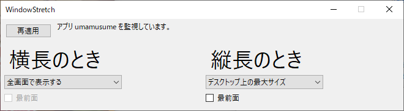

# WindowStretch
ウィンドウサイズと位置を、縦横比を維持しつつ最大化する。だいたいWin版「ウマ娘 プリティーダービー」用。

## インストール
1. .NET5 をインストールしてください。
2. Releasesからバイナリをダウンロードし、中身を解凍してください。

## アンインストール
解凍したフォルダを削除してください。設定データはAppData内に保存していますので、別途削除が必要です。

## 使い方
* ウマ娘が管理者権限で起動するので、本ツールも管理者権限で起動してください。
* 横長・縦長それぞれで「何もしない」「全画面表示」「デスクトップ最大表示」を選択します。
* 最小化すると、タスクトレイに格納されます。大画面のゲームをお楽しみください。

# 連絡
イシューやプルリク、 @seeker7200 (twitter) へどうぞ。

## ライセンス
本ツールは暫定MITとします。関連ライブラリ等のライセンス整理は進行中です。
