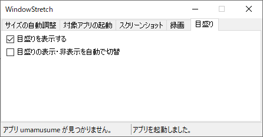

# WindowStretch
ゲーム画面のウィンドウサイズ調整等を行います。現在はDMM版「ウマ娘 プリティーダービー」用。

## このツールにできること

* ゲーム画面のウィンドウサイズを、縦横比を維持しつつ最大化します。縦長・横長の両方に対応します。
    * サイズ指定は必要ありません。モニターに対して適切な位置・サイズを自動的に計算します。
* ツールの起動と同時にゲームを起動できます。
* ゲーム画面のスクリーンショットを撮影できます。
    * スクロールする画面の全体を1枚の画像に撮影することもできます。
* ゲーム画面を録画できます。
* 育成画面の体力ゲージに目盛りを表示できます。
	

## インストール

[こちら](https://github.com/seeker3600/WindowStretch/releases/latest/download/WindowStretch.zip) から最新版をダウンロードし、zipファイルを解凍してください。

* Windows8.1、または 10 の古いバージョンをご利用の方は、 [.net framework 4.8](https://dotnet.microsoft.com/download/dotnet-framework/thank-you/net48-web-installer) をインストールする必要があります。
* Windows 10 April 2018 Update (1803) より前のバージョンをご利用の場合、録画機能は使用できません。

## アンインストール
解凍したフォルダを削除してください。設定データはAppData内に保存していますので、別途削除が必要です。

## 使い方
* 「WindowStretch.exe」を管理者権限で起動してください。ウマ娘を操作するには管理者権限が必要です。
* 最小化すると、タスクトレイに格納されます。
	* トレイアイコンをクリックすると再度表示します。
	* トレイアイコンを右クリックすると、コンテキストメニューを表示します。

### 「サイズの自動調整」タブ

* 横長・縦長それぞれで「何もしない」「全画面表示」「デスクトップ最大表示」を選択します。
* 全画面表示は、強制的に最前面に表示します。
	* 「少しのはみ出しを許容」にチェックすると、画面をはみ出させて隙間を埋めます。

### 「対象アプリの起動」タブ

* ウマ娘のスキーム(起動URI)を指定して、本ツールからウマ娘が起動できます。
	* デスクトップのショートカットを右クリックし、プロパティからURLを確認してください。
* 下のチェックを入れると、本ツール起動時にウマ娘を一緒に起動します。

### 「スクリーンショット」タブ

* 画像を保存するフォルダを指定して「撮影」ボタンを押すと、ウマ娘のスクリーンショットを撮ります。
	* フォルダが存在しないと撮影に失敗します。あらかじめフォルダを作成してください。
	* 「エクスプローラで開く」ボタンを押して、フォルダが開けるか確認できます。
* 左下のチェックを入れると、撮影時に画像をビューワで開きます。
* 右の領域から別のアプリにドラッグ＆ドロップできます。ブラウザに画像を直接投稿するときに便利です。
* スクロールする画面全体を撮影することができます。
    1. 「スクロール撮影」ボタンを押します。
    2. ゲーム画面をゆっくりスクロールします。タブがある場合、切り替えることができます。
    3. 「完了」ボタンを押します。画像が保存されます。なお、スクロール撮影はドラッグ＆ドロップに未対応です。

### 「録画」タブ

* 動画を保存するフォルダを指定して「録画開始」ボタンを押すと、ウマ娘の動画を撮ります。
	* フォルダが存在しないと録画に失敗します。あらかじめフォルダを作成してください。
	* 「エクスプローラで開く」ボタンを押して、フォルダが開けるか確認できます。
* 録画中の音はすべて録音されます。ほかのソフトが音を出さないか注意してください。

### 「目盛り」タブ

* 「目盛りを表示する」にチェックを入れると、育成の体力ゲージの位置に目盛りを表示します。
* ゲームで何をしているかに関係なく「表示するだけ」なので注意してください。
	
* 「目盛りの表示・非表示を自動で切替」にチェックを入れると、育成画面以外では目盛りを非表示にします。
	* アオハル、メイクラにて動作を確認しています。

## 対応環境

以下の環境で動作を確認しています。それ以外の環境で動く／動かない場合はご連絡ください。

* Windows 10 Pro バージョン 21H1 (x64) 
* Windows 11 Home バージョン 21H2 (x64) 

## TODO

* フルスクリーン時は省電力機能を無効化
* マルチモニター
* ファン数計測
* 録画周りの改善
* ミュート
* リファクタリング
    * MAUI
    * 設定ファイル

## 連絡
イシューやプルリク、 @seeker7200 (twitter) へどうぞ。
プロジェクトサイトは[こちら](https://github.com/seeker3600/WindowStretch)です。

## ライセンス
MIT
